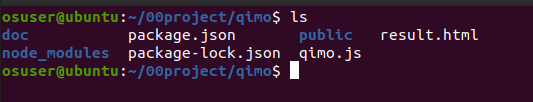
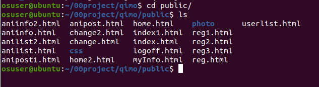
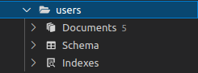
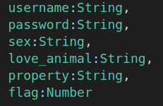
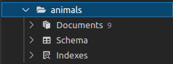
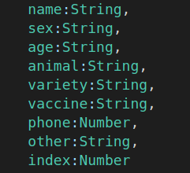

# README 有家项目说明

## 1.项目设计部分

（1）项目总体构成

本项目主要用于面向用户以及管理员的B/S类型的信息管理系统，主题是流浪动物的领养信息发布。

系统编程语言是nodejs，数据库使用mongodb，后端架构用express。（html页面的引入了bootstrap.css）

（本次项目的html页面主要是我引用以前javaweb作业的改编的，故开发过程会出现.jsp相关）

（2）引入的包在项目中的相关说明

本系统中，编写的代码中安装了express，进行后端搭建；安装ejs，用于输出输出渲染后的 HTML 字符串；用mongoose，简化nodejs使用mongodb数据库。

（3）项目目录结构和各个部分的说明

项目目录结构：

doc文件夹：存储README.md文件以及图片

qimo.js：为主要的项目js文件

public文件夹：存储所有项目用到的html文件	photo文件夹存放网页显示的图片	css文件存放bootstrap.css

(混进了一个result.html 是无关文件)

## 2.使用说明书

本项目包含了以下功能：

#### 1.**面向用户**

|       主要页面       |             主要功能             |           备注（相关的html）            |
| :------------------: | :------------------------------: | :-------------------------------------: |
|       登录页面       |             登录账号             |              index.html等               |
|       注册页面       |            注册新账号            |               reg.html等                |
|        主页面        |   跳转到各个功能页面，登出功能   |                home.html                |
|     个人信息页面     | 查看个人信息，修改密码，注销账户 | myInfo.html，change.html等，logoff.html |
|   动物领养展示页面   |  查看所有在列的流浪动物大致信息  |              anilist.html               |
|   动物详细信息页面   |        查看动物的详细信息        |              aniinfo.html               |
| 流浪动物信息上传页面 |       上传待领养的动物信息       |             anipost.html等              |

#### 2.**面向管理员**

|     主要页面     |               主要功能               | 备注（相关的html） |
| :--------------: | :----------------------------------: | :----------------: |
|     登录页面     |            登录管理员账号            |    index.html等    |
|      主页面      |     跳转到各个功能页面，登出功能     |     home2.html     |
| 用户列表显示页面 |           查看所有使用用户           |   userlist.html    |
| 动物领养展示页面 |    查看所有在列的流浪动物大致信息    |   anilist2.html    |
| 动物详细信息页面 | 查看动物的详细信息，删除该条动物信息 |   aniinfo2.html    |

本项目创建了的数据表有：users、animals

其中users有以下几种字段：

flag:用于区分普通用户和管理员

其中animals有以下几种字段：

index:用于记录当前是第几条数据

## 3.开发日记

#### day1.

**Commits on Dec 19, 2021 on main**

Initial commit （初始新建立一个新的远程仓库）

**Commits on Dec 19, 2021 on master**

index.html and reg.html finish （完成了index.html和reg.html页面的编写，尚未完成js文件中对应功能跳转）

step2（如何从一个页面跳转到另一页面困扰了我好久）

#### day3.

**Commits on Dec 20, 2021 on master**

day3 （成功解决了页面跳转问题，创建了主页面、个人信息页面、动物领养展示页面，完成了登录、注册、查看个人信息功能）

#### day4.

**Commits on Dec 22, 2021** **on master**

day4 （创建了流浪动物信息上传页面，完成了流浪动物信息上传的功能，尚未完成动物领养列表的展示功能）

#### day5.

**Commits on Dec 23, 2021** **on master**

day5（增加了修改密码和注销账户的功能，完成动物领养列表的展示功能，面向用户的使用功能大致完成）

finish all the functions （增加用户注销提醒页面，和细节上的修改）

add some about admin functions （增加管理员的相关功能和管理员使用页面，完成面向管理员的使用功能，对nodejs以及mongodb使用熟悉后进展很快）

add README.md（增加README）
